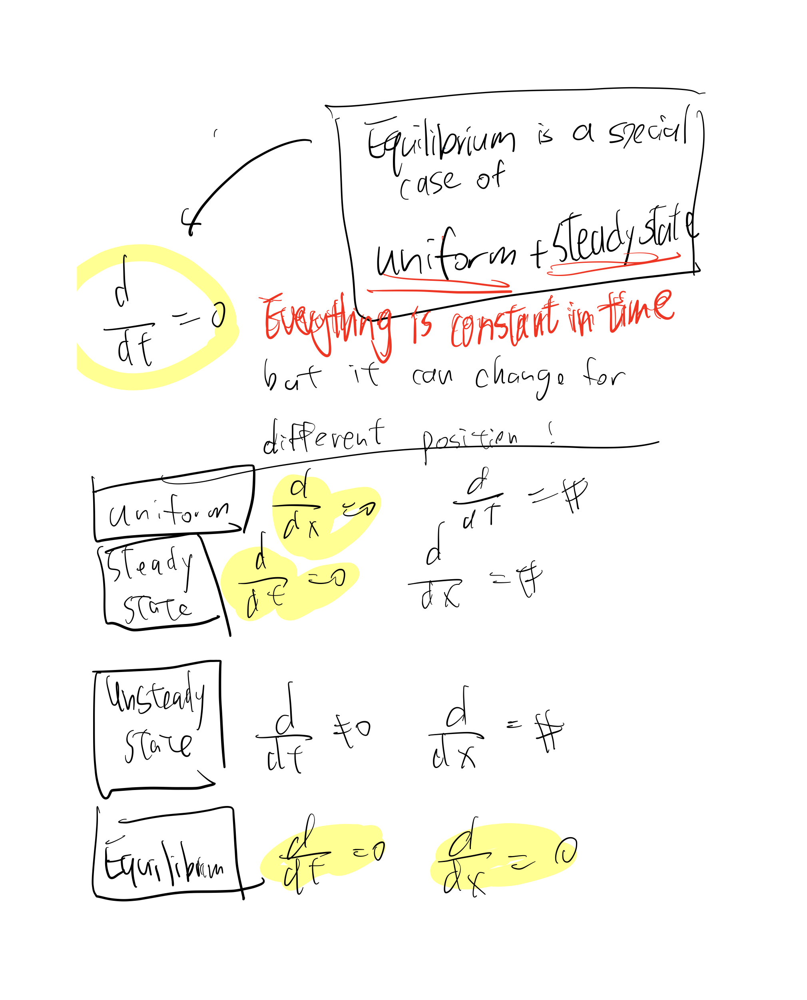
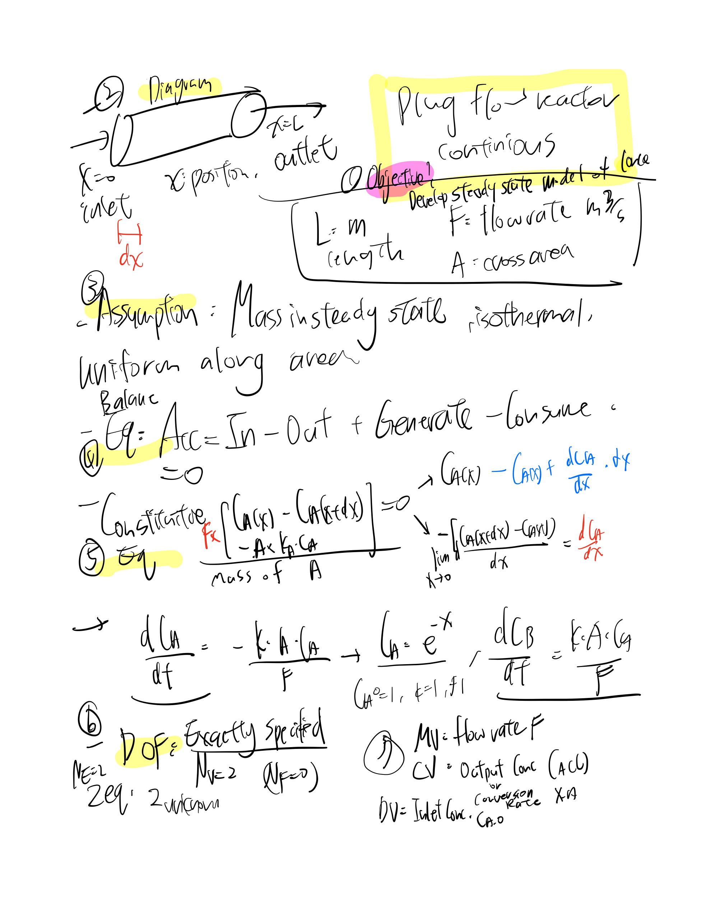
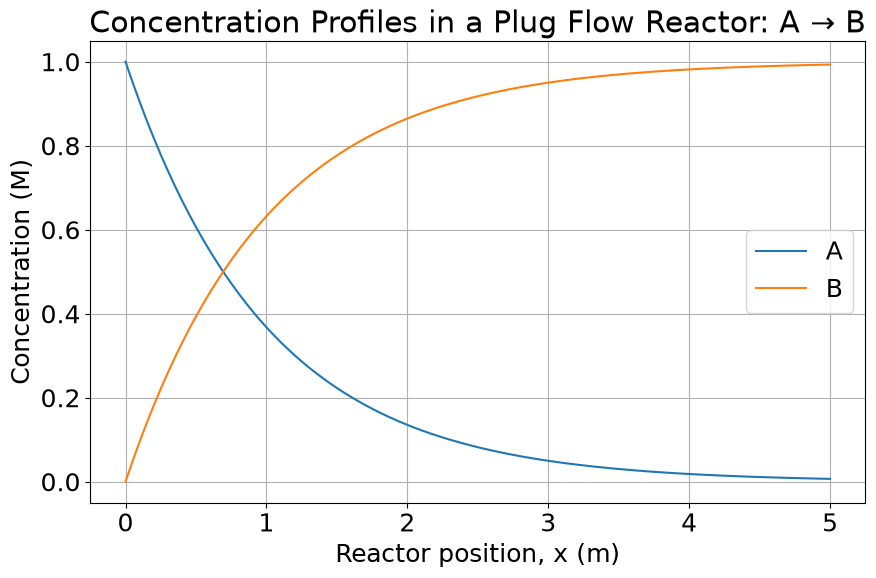
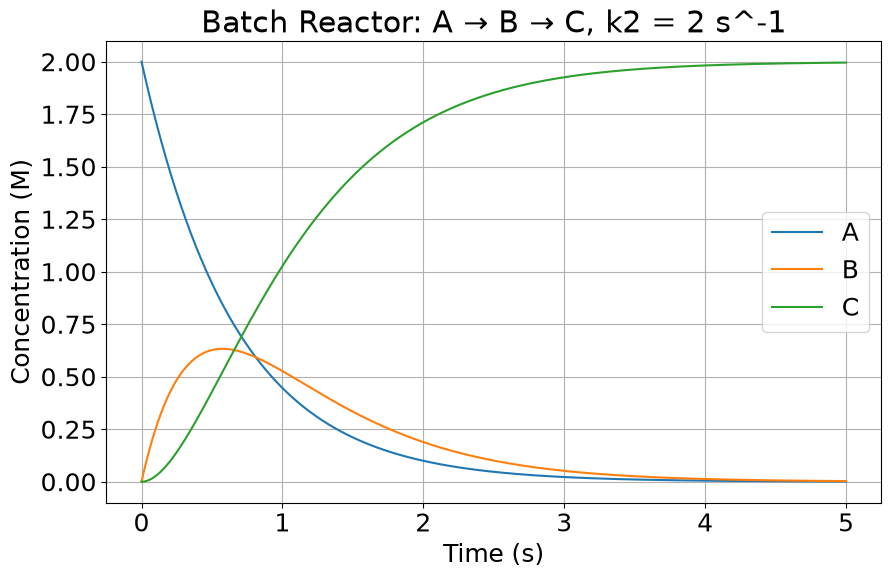
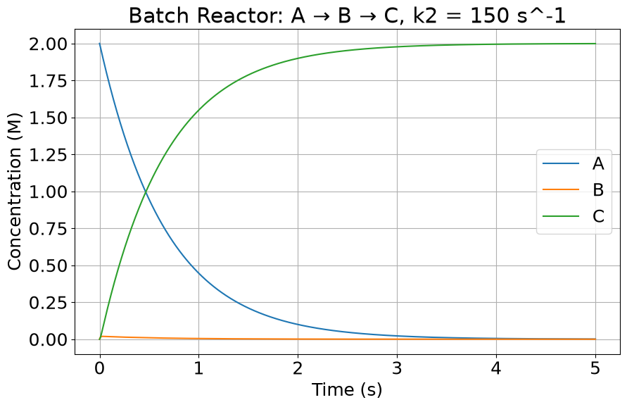
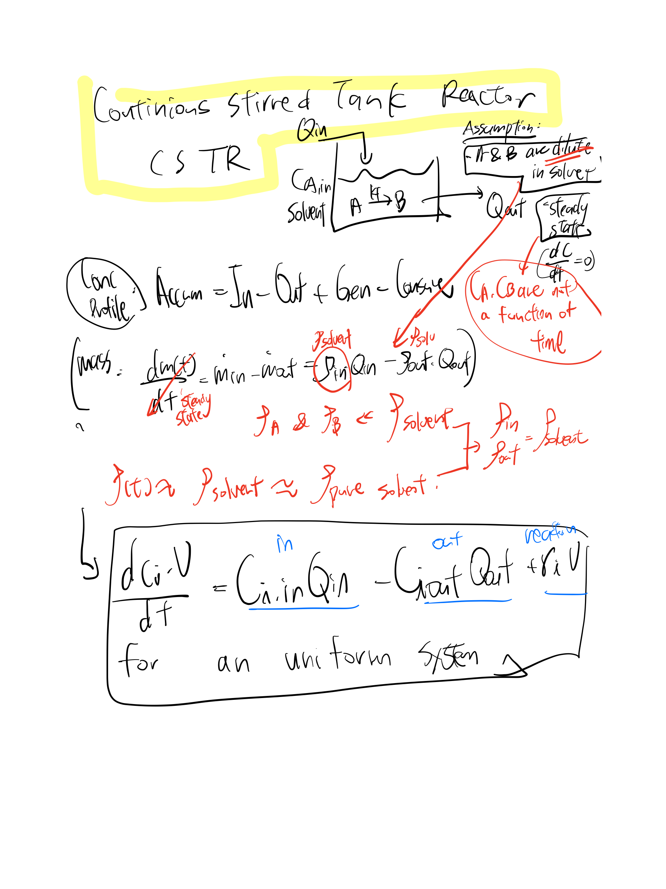
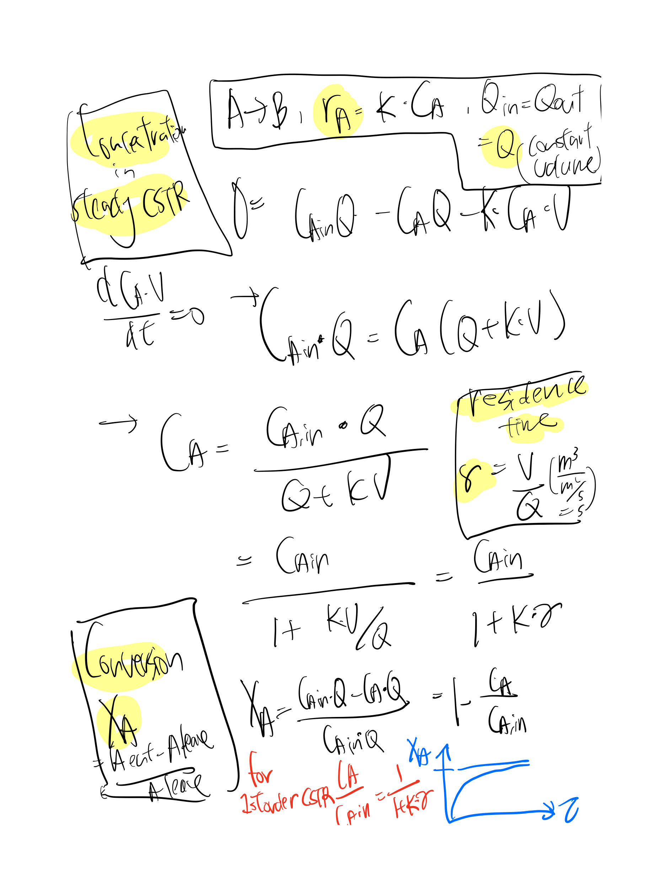
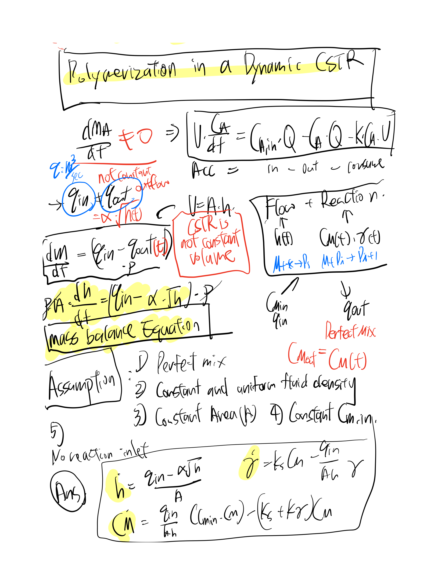
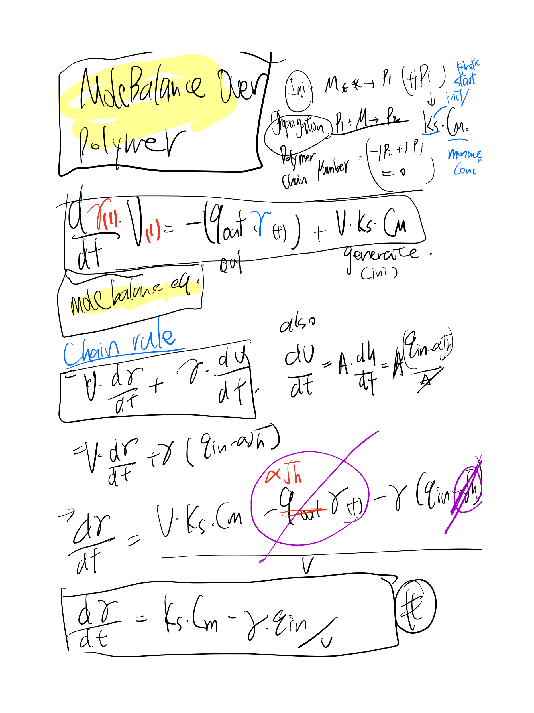
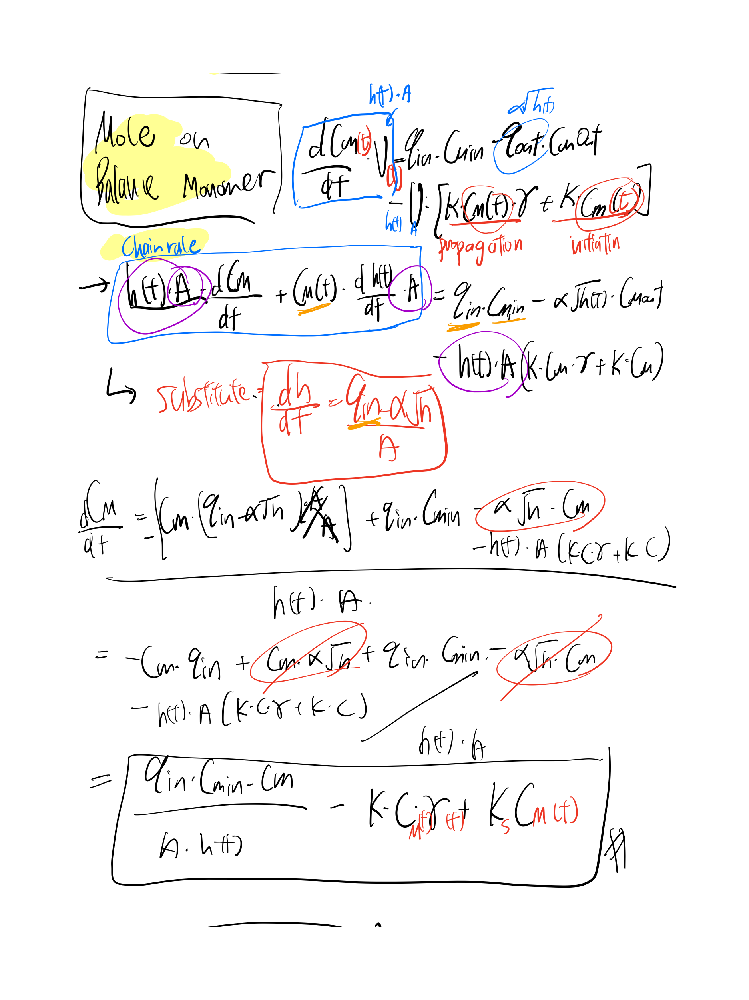

# CHMENG162-DynamicControl

- Textbook:
Process Control: Modeling, Design, and Simulation
Wayne Bequette (Publisher: Prentice Hall, 2003)

- Definition:
What is a Mathematical Model? > A model is an abstraction of reality! /  George E. P. Box(1976): All models are wrong, but some are useful

- Eykhoff (1974):
“a representation of the essential aspects of an existing system (or
a system to be constructed) which represents knowledge of that
system in a usable form”

- Dynamic model:
Mathematical description of the transient (unsteady state) behavior of a process

## General Procedure for Developing Dynamic Models
1. State model objective and end use (level of complexity)
2. Draw schematic diagram of process and label all process variables
3. List all assumptions
4. Write balance equation
5. Introduce constitutive equations
6. Perform degrees of freedom (Is the model solvable?)
7. Classify input as Dependent Variables I(What effect outcome but I cannot control)or Manipulate variable (What can I do to controk)

## Concepts:

- Physics-based process modeling(Assumption Must be made!): Mass Balance for Blending System, Steady State Mass Balance , Possible Control Strategies (Feedforward, FeedBack),  
- Analysis of dynamical systems: What and why build models? 3 Model Approaches:
- A) Physics-based (white box) e.g Arrhenius equation $$k= Aexp(-E/RT)$$ where rate depend on temp --> Material and energy balances, Heat , Mass , momentum transfer , thermo/chem kinetics, (Scalable / expensive )
- B) Data-Driven (black box) $$\min_{\theta} \sum_{i=1}^{n} l(y_i, f(u_i; \theta))$$ (general applied, fail to extrapolate to edge case , require a large of data )
- C) Semi-Emperical : e.g Unsteady State isothermal CSTR: assumption first-order reaction (ssumption when only based on data) , assumption density of inlet and outlet stream cosntant, liquid volume constant, temp , perfect mix
- Empirical process modeling
- Feedback control and PID control design
- Direct control synthesis
- Internal model control
- Feedforward/cascade control
- Closed-loop interactions in multi-loop control systems
- Frequency-response analysis
- Statistical process control

#  Model Types: Foundations & Examples

| Model Type | Alias | Foundation | Examples & Details |
| :--- | :--- | :--- | :--- |
| **Physics-Based** | "White Box" | Governing physical laws (Mass/Energy/Momentum Balance, Thermodynamics, Chemical Kinetics).<br><br>**Core Principle:**<br>Accumulation = In − Out + Generation | **Example (Arrheniius Eq):**<br> $k = A \exp(-E_a/RT)$ |
| **Semi-Empirical** | "Gray Box" | Combines physical conservation laws with experimentally fitted relationships (e.g., balance equations from physics, kinetics from data). | **Example (Isothermal CSTR):**<br> $\frac{dC_a}{dt} = \frac{F}{V}(C_{a,in} - C_a) - kC_a$<br><br>**Assumptions:**<br>• Perfect mixing<br>• Constant volume/density<br>• Isothermal<br>• 1st-order reaction |
| **Data-Driven** | "Black Box" | Learns relationships directly from observations without requiring physical equations. Minimizes error between predicted and actual data. | **Examples:**<br>• Machine learning<br>• Neural networks<br>• Regression |

#  Definition of unsteady state, steady state and equilibium



## W2 Lab 
 Ordinary Differential Equations (ODEs)

An **Ordinary Differential Equation (ODE)** describes how a dependent variable changes with respect to a single independent variable.

For example,

$$
\frac{dy}{dt} = f(t,y)
$$

where:

- $t$ = independent variable, usually time
- $y$ = dependent variable
- $\frac{dy}{dt}$ = rate of change of $y$
- $f(t,y)$ = model describing the system dynamics

### W2 Concepts
- scipy.integrate import solve_ivp for initial value problem y(0) = y_0
- Explicit and Implicit Solver: Backward Differentiation Formula
- Robertson's Stiff ODE Problem


### Examples1 : Spatial ODE iPFR in steady state



- 1.Consider a **steady-state plug flow reactor**, with flow rate $F= 1 m^3/s$ , length $L=5 m$ and cross-sectional
area $A=1 m^2$. Consider a single step first-order, irreversible reaction : $$A→B$$ Consider the initial concentration of $A$ to be $1 M$  at the inlet. Perform a component balance over a differential element $dx$ along the reactor. Assume $k=1 s^{-1}$ to be the rate constant for the reaction. Now, could you frame a first-order differential equation from this balance? Solve it and plot the concentration profile of A and B along the $x$ direction. 

- 1.1 Objective: Steady state spatial model , indepent variable is location x(0<x<L) (not time t!) 

- 1.2 Diagram and variables
 
```
x = 0                                             x = L
Inlet                                               Outlet
  |                                                   |
  v                                                   v
-------------------------------------------------------
|                                                     |
|              Plug Flow Reactor                      |
|                                                     |
-------------------------------------------------------
          ---> flow direction --->

       |---- dx ----|

       differential volume:
       dV = Ac dx
       F= Volumetric flow rate , A = reactor cross section area , k = first order rate constant
```

- **1.3 Assumptions**: steady state concentration no accumulation , uniform concentration over each cross section C = C(x) , Constant volumetric flow rate / cross section area / isothermal operation (k = constant) / reaction stoichiometry 1:1
- **1.4 Mass Balance Equations** - Acc= In - Out + Gen - Consume / Steady State : Acc = 0 
- **1.5 Constituitive Equations** $$F C_A(x)$$, 2 Methods Approach
- A)  The molar flow leaving at $x+dx$ is:
 $$F C_A(x+dx)$$ Using a **first-order Taylor expansion**: $$C_A(x+dx) \approx C_A(x) + \frac{dC_A}{dx}dx$$ Therefore, the outlet flow is: $$F \left( C_A + \frac{dC_A}{dx}dx \right)$$
- B) $$\{F(C_A(x+dx)-C_A(x))=-kC_AA_cdx}$$ and use the **definition of derivative** $$\frac{dC_A}{dx}=\lim_{dx\to0}\frac{C_A(x+dx)-C_A(x)}{dx}$$

 | Method              | Main idea                                                    | Key equation                                                   |
| ------------------- | ------------------------------------------------------------ | -------------------------------------------------------------- |
| Taylor expansion    | Approximate \(C_A(x+dx)\) using the derivative               | $$C_A(x+dx)\approx C_A(x)+\frac{dC_A}{dx}dx$$                |
| Difference quotient | Keep the inlet-outlet difference first, then take \(dx\to0\) | $$\frac{dC_A}{dx}=\lim_{dx\to0}\frac{C_A(x+dx)-C_A(x)}{dx}$$ |

- Result

$$
\frac{dC_A}{dx}=-\frac{kA_c}{F}C_A
$$

$$
\frac{dC_B}{dx}=\frac{kA_c}{F}C_A
$$


 - **1.6  Degrees of Freedom for  Unknown dependent variables**: $$C_A(x),\ C_B(x)$$ Number of unknowns: $$N_{\text{unknowns}}=2$$ Number of independent equations: $$N_{\text{equations}}=2$$ Therefore: $$DOF=N_{\text{unknowns}}-N_{\text{equations}}$$ $$DOF=2-2=0$$ Thus: $$\{DOF=0}$$ The model is fully specified and solvable.
 -   Final Analytical Solution Because: $$A_c=1,\ k=1,\ F=1$$ the concentration of A is:  $${C_A(x)=e^{-x}}$$  The concentration of B is: $${C_B(x)=1-e^{-x}}$$
 -   Spatial ODE vs. Dynamic ODE For this steady-state PFR, the model is a spatial ODE: $$\{\frac{dC}{dx}=f(C)}$$ The independent variable is position $x$. For a dynamic reactor model: $$\boxed{\frac{dC}{dt}=f(C,u)}$$ The independent variable is time $t$.

 -   **1.7 Variables**
 -   MV(what i can change): flow rate,
 -   CV (what i want to change): C_A(x) out concentration or Conversion rate
 -   DV (what i cannot change): Inlet Concentration



### Example 2: Well mixed time-dependent Batch Reactor (Accumulation is not zero!), with Stiff Problem 
for 2. it is a non-continious batch reactor, object is to build concentration time profile C(t), assumption is isothermal, Both reactions are irreversible. balance is also **mass accumulation = Generation, so not in steady state!**, consecutive equations are pure reaction kinetic of time since the concentration does not depend on location and volume , degree of freedom is 0 since equation =3, variable =3, DVs are concentration of C , 

```
        Batch Reactor
    ---------------------
    |                   |
    |     A → B → C     |
    |                   |
    |   Well mixed      |
    |   V = 3 m³        |
    ---------------------

        No inlet
        No outlet

        C = C(t)
```



### Ex.2 Discussion : Stiff ODEs Systems 

Stiff systems are common in chemical engineering, particularly when we have reactions with a wide range of timescales including both fast and slow reactions. For these systems, standard explicit solvers require impractically small time steps to maintain numerical stability, even when the solution itself is changing slowly.

The system of ODEs we will use is a classic stiff ODE example from chemical kinetics, known as Robertson's problem. It involves three species with very different reaction rates, creating a wide range of timescales.

The system of ODEs is given by:

$$
\frac{d[X]}{dt} = -0.04[X] + 10^4[Y][Z]
$$

$$
\frac{d[Y]}{dt} = 0.04[X] - 10^4[Y][Z] - 3 \times 10^7[Y]^2
$$

$$
\frac{d[Z]}{dt} = 3 \times 10^7[Y]^2
$$

The very large rate constants ($10^4$ and $3 \times 10^7$) make this a stiff system.

### Ex.2 Discussion : Explicit vs. Implicit Solvers

The key difference between explicit and implicit solvers is how they calculate the system's state at a future time step.

An **explicit solver** calculates the state of a system at a later time from the state of the system at the **current time only**. This approach is simpler to program but is "conditionally stable," meaning it requires very small time steps to avoid instability or "exploding" solutions, particularly for stiff problems. The default solver for `solve_ivp`, `'RK45'`, is an example of an explicit solver.

An **implicit solver** finds a solution by solving an equation that involves **both the current and future states** of the system. This method is more computationally intensive per step but is "unconditionally stable" and can therefore take much larger time steps, making it much more efficient and reliable for solving stiff ODEs. The `'BDF'` (Backward Differentiation Formula) solver, available in `solve_ivp`, is an example of an implicit solver and is a good choice for stiff problems.

```
# Define the stiff ODE system (Robertson's problem)
def robertson_relaxed_ode(t, y):
    """
    Defines the system of stiff ODEs for Robertson's chemical reaction.
    y[0] = [X], y[1] = [Y], y[2] = [Z]
    """
    X, Y, Z = y
    dXdt = -0.04 * X + 1e4 * Y * Z
    dYdt = 0.04 * X - 1e4 * Y * Z - 1e7 * Y**2
    dZdt = 3e7 * Y**2
    return [dXdt, dYdt, dZdt]
# --- Attempt to solve with the default explicit solver ('RK45') ---
# We will use a relatively loose tolerance to make sure it runs without taking forever.
solution_rk45 = integrate.solve_ivp(robertson_ode, t_span, y0, method='RK45', t_eval=t_eval)

```


```
# Define the stiff ODE system (Robertson's problem)
def robertson_relaxed_ode(t, y):
    """
    Defines the system of stiff ODEs for Robertson's chemical reaction.
    y[0] = [X], y[1] = [Y], y[2] = [Z]
    """
    X, Y, Z = y
    dXdt = -0.04 * X + 1e4 * Y * Z
    dYdt = 0.04 * X - 1e4 * Y * Z - 1e7 * Y**2
    dZdt = 3e7 * Y**2
    return [dXdt, dYdt, dZdt]

solution_bdf = integrate.solve_ivp(robertson_ode, t_span, y0, method='BDF', t_eval=t_eval)


```


#  Exercise Case 1: : Unsteady-State CSTR with Radical Polymerization

A Continuous Stirred-Tank Reactor (CSTR) can be used in radical polymerization processes. Consider an isothermal CSTR that receives a feed of solvated fresh monomer $M$ with flow rate $q_{\text{in}}$ and monomer concentration $C_{M,\text{in}}$. A valve is placed on the inlet stream to the CSTR. The CSTR is not constant volume since its outlet flow varies in time as:

$$q_{\text{out}}(t) = \alpha \sqrt{h(t)}$$

where $\alpha$ is a constant and $h(t)$ is the liquid level in the tank.

---

### Chemical Reactions & Kinetics

In a propagation reaction, a unit of monomer $M$ can react with a polymer chain of length $i$ in an elementary step:

$$M + P_i \rightarrow P_{i+1}$$

For each reaction, the rate constant is the same, such that the rate of disappearance of $M$ during propagation can be written as:

$$r_M = k C_M C_{P_1} + k C_M C_{P_2} + k C_M C_{P_3} + \dots = k C_M \sum_{i=1}^{\infty} C_{P_i}$$

For convenience, we define the total polymer concentration as:

$$\gamma(t) = \sum_{i=1}^{\infty} C_{P_i}$$

The radical chain reaction is started with an initiation reaction:

$$M + * \rightarrow P_1$$

which has the following rate law:

$$r_{\text{initiation}} = k_s C_M$$

> **Note:** The reaction has no termination step (i.e., all polymer species remain reactive).

---

### Questions

* **(a)** List the potential manipulated variable(s), controlled variable(s), and disturbance variable(s) for this process.
* **(b)** Derive the model that describes the dynamics of the liquid level in the tank ($h(t)$), the concentration of monomer ($C_M(t)$), and the sum of polymer concentrations ($\gamma(t)$) as a set of three coupled ODEs. Clearly state all your modeling assumptions.

>  **Hint:** $\gamma(t)$ is not affected by the propagation reaction and is not present in the feed.








